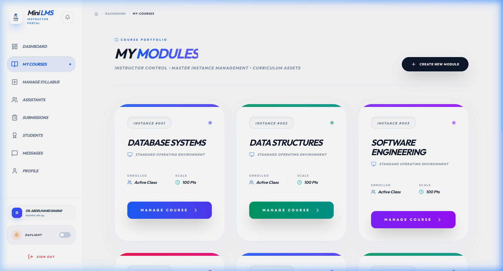
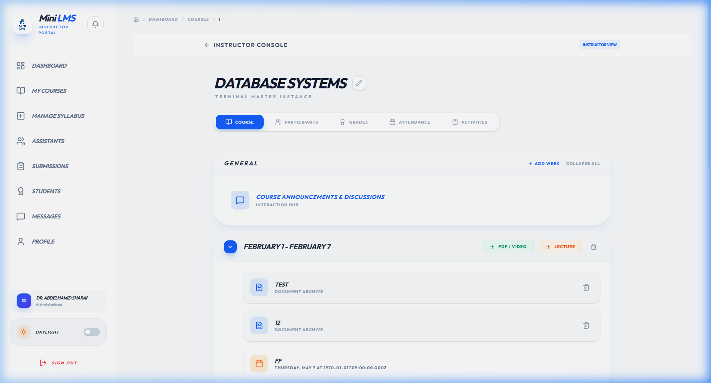
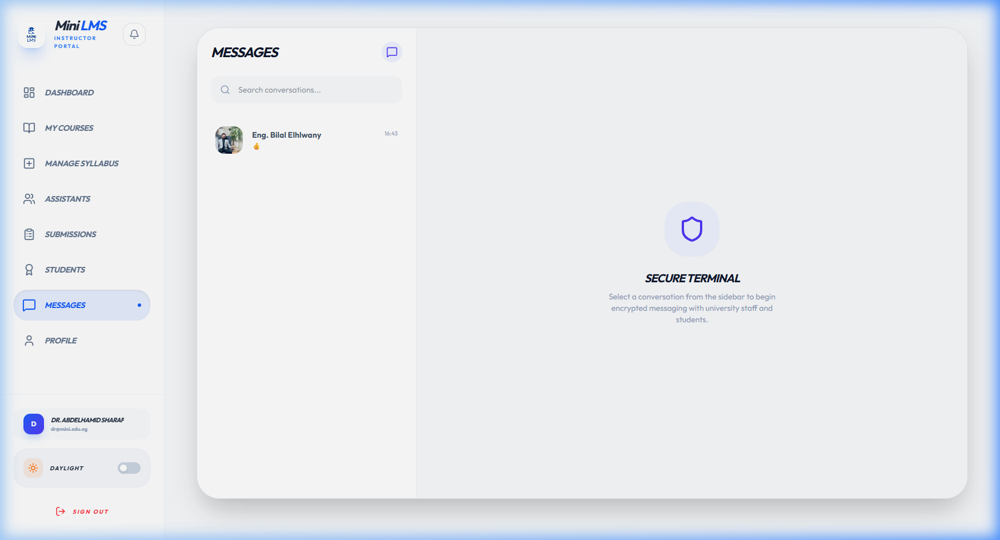
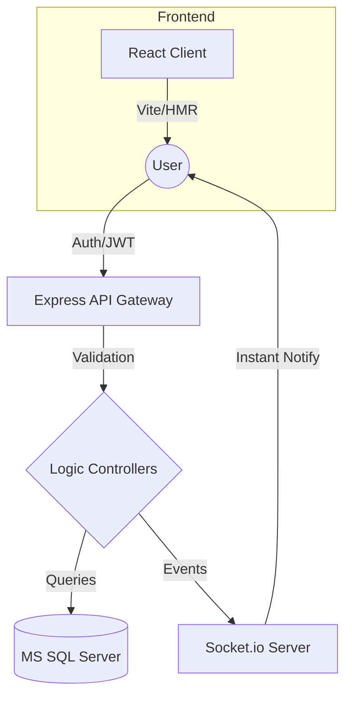

<div align="center">
  
  
  # 🎓 Mini LMS: Full-Stack University Portal
  
  **A sophisticated, role-based Learning Management System designed for modern education.**
  
  ---
  
  
  [](https://nodejs.org/)
  [](https://reactjs.org/)
  [](https://www.microsoft.com/en-us/sql-server)
  [](https://socket.io/)

  *Bridging the gap between students, instructors, and assistants through a unified, glassmorphism-inspired digital environment.*
  
  ---
</div>

## 🖼️ Interface Showcase

<div align="center">
  <table>
    <tr>
      <td width="50%"></td>
      <td width="50%"></td>
    </tr>
    <tr>
      <td align="center"><b>Command Center (Dashboard)</b></td>
      <td align="center"><b>Module Portfolio</b></td>
    </tr>
    <tr>
      <td width="50%"></td>
      <td width="50%"></td>
    </tr>
    <tr>
      <td align="center"><b>Deep Course Analytics</b></td>
      <td align="center"><b>Real-Time Communication</b></td>
    </tr>
  </table>
</div>

---

## 🏛️ System Architecture

Our architecture is designed for **High Availability** and **Scalability**. Below is a high-level overview of the data flow and role-based interaction:



---

## 💎 Core Experiences

- **👨‍🎓 Personal Academic Journey**: Every student receives a tailored dashboard to track progress, upcoming deadlines, and academic achievements.
- **👨‍🏫 Master Course Governance**: Instructors wield comprehensive tools for syllabus design, assistant oversight, and global student management.
- **⚡ Real-Time Synergy**: Integrated WebSockets ensure that messages, grades, and notifications reach users in milliseconds—no refresh required.
- **🌓 Adaptive Aesthetics**: A custom-crafted design system with full support for stunning **Dark** and **Light** modes, optimized for any environment.

---

## 🛡️ Technical Hardening

- **Advanced Security**: Implemented JWT-based stateless authentication, Helmet security headers, and global rate limiting to mitigate DDoS threats.
- **Data Integrity**: Robust SQL schema with complex cascades and referential integrity ensuring zero data loss during course restructures.
- **Performance**: Vite-powered frontend with code-splitting and asset optimization for sub-second load times.

---

## 📂 Project Navigation

<details>
<summary><b>📂 Repository Blueprint (Click to Expand)</b></summary>
<br>

| Module | Responsibility | Stack |
| :--- | :--- | :--- |
| **`LMS_Backend`** | Data Persistence, Auth, Real-time Events | `Node.js`, `SQL Server`, `Socket.io` |
| **`mini-lms-frontend`** | Interactive UI, State Management, Routing | `React`, `Context API`, `Vanilla CSS` |
| **`assets`** | Brand Identity & Visual Documentation | `High-Res Screenshots`, `Logos` |

</details>

> [!IMPORTANT]
> For a line-by-line breakdown of every script in the project, consult our [**STRUCTURE.md**](./STRUCTURE.md).

---

## 🚀 Deployment Guide

### 1. Preparation
Ensure your environment satisfies the following:
- **Node.js v16+**
- **MS SQL Server** (SQLEXPRESS or Developer)

### 2. Ignition
```bash
# Clone the Vision
git clone https://github.com/omarwageih/MUST-University-LMS.git

# Ignite Backend
cd LMS_Backend
npm install && npm start

# Launch Frontend
cd ../mini-lms-frontend
npm install && npm run dev
```

---

## 🗺️ Project Roadmap

- [x] **Phase 1**: Core Authentication & Role Management
- [x] **Phase 2**: Course & Syllabus CRUD Operations
- [x] **Phase 3**: Real-time Messaging & Notifications
- [/] **Phase 4**: Advanced Grading Analytics & Performance Reports
- [ ] **Phase 5**: Mobile Companion App (PWA)

---

<div align="center">
  <br>
  <sub><b>CSE 301 Database Project</b></sub><br>
  <sub><i>Crafted with precision for the MUST University community. Built by ❤️.</i></sub>
</div>
