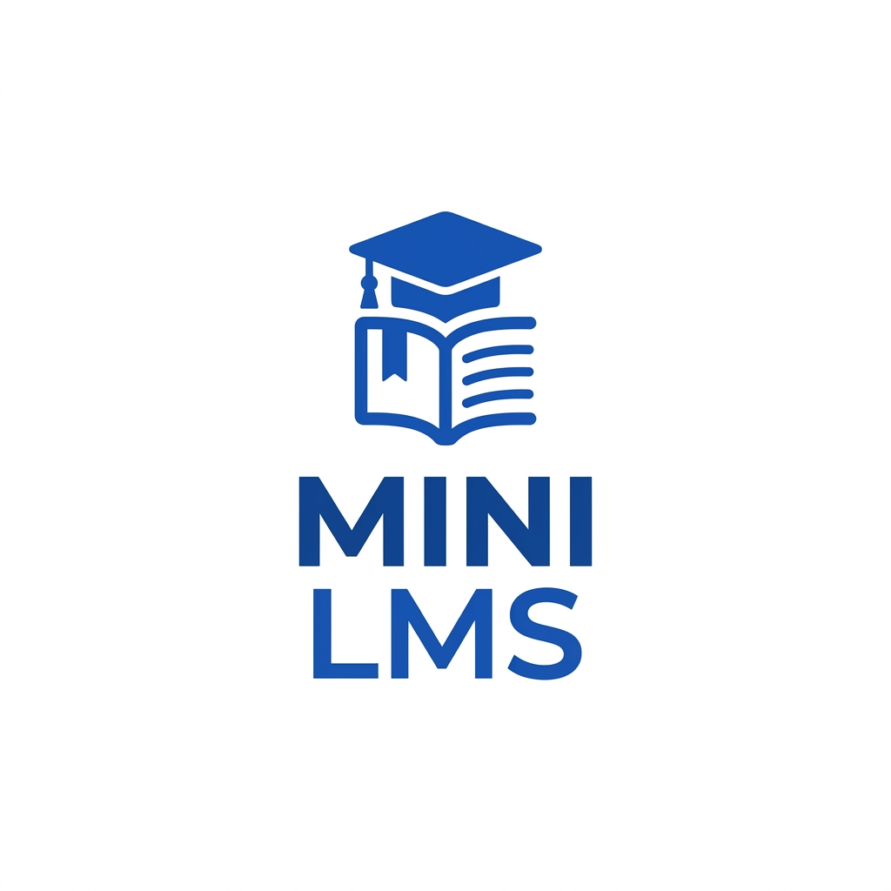
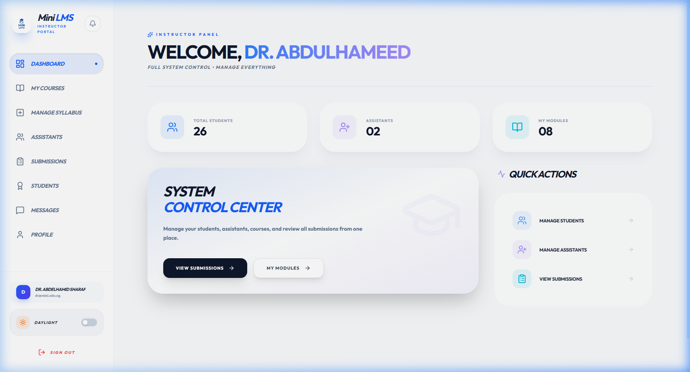

<div align="center">
  
  
  # 🎓 Mini LMS: Full-Stack University Portal
  
  **A sophisticated, role-based Learning Management System designed for modern education.**
  
  ---
  
  [](https://nodejs.org/)
  [](https://reactjs.org/)
  [](https://www.microsoft.com/en-us/sql-server)
  [](https://socket.io/)
  [](#)

  *Bridging the gap between students, instructors, and assistants through a unified, glassmorphism-inspired digital environment.*
  
  ---
  
  ### 📱 System Preview
  
</div>

---

## 💎 Core Experience

### 🚀 **Empowered Learning**
Every student gets a personalized workspace to track their **academic journey**. From instant grade notifications to seamless assignment submissions, the platform is built for speed.

### 🏛️ **Academic Governance**
Instructors wield total control over their courses. Manage **Syllabi**, oversee **Assistant** performance, and handle **Student Enrollment** with a single click.

### ⚡ **Real-Time Synergy**
Powered by **WebSockets**, our system ensures you never miss a beat. Messages and notifications arrive instantly, keeping the academic community connected 24/7.

---

## 🛠️ Architectural Blueprint

<details>
<summary><b>📡 Backend Infrastructure</b></summary>
<br>
<blockquote>
The backend is a robust Node.js cluster utilizing Express for API routing and SQL Server for enterprise-grade data persistence. 
</blockquote>

- **Security**: Hardened with JWT, Helmet, and Rate Limiting.
- **Data**: Complex relational schema with cascaded deletions and automated migrations.
- **Logic**: Clean controller-service pattern for maximum maintainability.
</details>

<details>
<summary><b>🎨 Frontend Excellence</b></summary>
<br>
<blockquote>
A premium React application built on Vite, featuring a custom-crafted CSS design system with full Dark Mode support.
</blockquote>

- **Design**: Modern glassmorphism UI with smooth role-based navigation.
- **State**: Global authentication and theme contexts.
- **Performance**: Optimized asset loading and component memoization.
</details>

---

## 📂 Project Navigation

| Module | Purpose | Key Technologies |
| :--- | :--- | :--- |
| **`LMS_Backend`** | API Services & DB | `Node.js`, `MS SQL`, `JWT` |
| **`mini-lms-frontend`** | UI & User Experience | `React`, `Vite`, `Vanilla CSS` |
| **`assets`** | Brand Identity | `Media`, `Logos` |

> [!IMPORTANT]
> To understand the deep-level logic of each file, please refer to our comprehensive [**STRUCTURE.md**](./STRUCTURE.md).

---

## ⚙️ Deployment Guide

### 1. Environment Prep
Ensure you have **Node.js v16+** and **SQL Server** installed and running on your local machine.

### 2. Ignition
```bash
# Clone the vision
git clone https://github.com/omarwageih/MUST-University-LMS.git

# Ignite Backend
cd LMS_Backend
npm install && npm start

# Launch Frontend
cd ../mini-lms-frontend
npm install && npm run dev
```

---

<div align="center">
  <br>
  <sub><b>CSE 301 Database Project</b></sub><br>
  <sub><i>Crafted with precision for the MUST University community.</i></sub>
</div>
